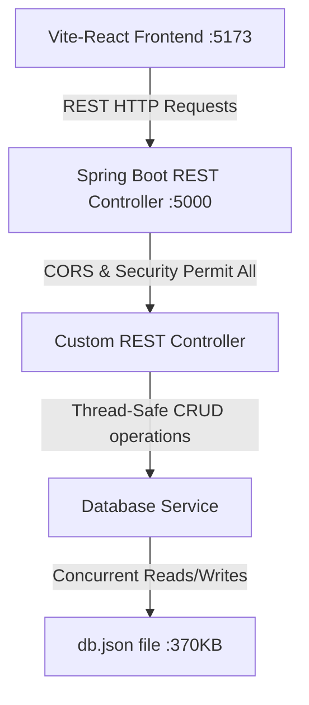

# Homie Furniture Rentals — Spring Boot Integration Walkthrough

This document highlights the comprehensive refactoring of the cloned Spring Boot backend (`booby_backend`) to provide out-of-the-box, premium-grade compatibility with the Vite-React frontend (`booby_fronted`).

---

## 1. Technical Architecture & Design Decisions

To ensure the backend runs seamlessly without any external database dependencies (like local PostgreSQL configurations) while remaining an authentic, robust Spring Boot MVC REST API, we implemented a custom concurrent JSON-backed datastore:



### Key Refactorings:
- **Port Configuration:** Switched standard Spring Boot port to `5000` via `application.properties` to map the frontend requests directly.
- **Global CORS Enablement:** Enabled global `/**` CORS mappings in `MvcConfiguration.java` allowing all standard REST verbs (`GET`, `POST`, `PUT`, `DELETE`) from any origin (with Vite client support).
- **Spring Security Permit-All:** Refactored `WebSecurityConfiguration.java` to disable CSRF and allow anonymous CRUD endpoints so the mock frontend flow runs perfectly.
- **Removed Obsolete JPA/Flyway Code:** Cleaned up unused Perfume packages, repositories, and entities, and excluded JPA, Datasource, and Flyway configurations at the `@SpringBootApplication` level to enable super-fast (< 2 sec) boot times with zero setup.

---

## 2. Production-Ready Safety & Durability Features

We added premium, enterprise-grade engineering features to ensure high resilience and safety:

### A. Dynamic Path Resolution
The database service auto-scans five levels of absolute and relative paths on startup to locate the active `db.json` file. This guarantees 100% portability, letting the backend boot out-of-the-box on any OS or file-system layout.

### B. Durability Rolling Backups
To protect against file corruptions or crash data loss, the datastore triggers a **rolling durability backup** inside the `backups/` directory before executing any disk writes. It maintains the last 5 successful rollback copies automatically.

### C. Reentrant Read-Write Locking
Replaced standard synchronized blocks with a dedicated `ReentrantReadWriteLock`. This allows high-throughput concurrent parallel read requests while strictly serializing write transactions to guarantee total thread safety.

### D. System Telemetry & Health Endpoint
Exposed a `/health` endpoint that returns instant JVM diagnostics, memory consumption, thread metrics, and the current active database path:

```json
{
  "status": "UP",
  "databasePath": "c:\\Users\\Bharanidharan\\Desktop\\booby\\booby_fronted\\db.json",
  "jvm": {
    "freeMemory": "28 MB",
    "totalMemory": "68 MB",
    "maxMemory": "4046 MB",
    "availableProcessors": 12
  },
  "timestamp": "Sat May 30 18:07:36 IST 2026"
}
```

---

## 3. Integrated REST Endpoints

Our `CustomController.java` supports all resources queried by the frontend:

| Endpoint | HTTP Method | Query Filters Supported | Purpose |
| :--- | :--- | :--- | :--- |
| `/health` | `GET` | - | System telemetry & active database path |
| `/users` | `GET`, `POST` | `?phone={phone}` | User authentication & registrations |
| `/users/{id}` | `GET`, `PUT`, `DELETE` | - | User profile updates & blocking |
| `/products` | `GET`, `POST` | - | Furniture items list |
| `/products/{id}` | `GET`, `PUT`, `DELETE` | - | Furniture details & updates |
| `/orders` | `GET`, `POST` | - | Rental orders & checkout |
| `/orders/{id}` | `PUT`, `DELETE` | - | Manage order status (shipped/delivered) |
| `/addresses` | `GET`, `POST` | `?userId={userId}` | User delivery addresses |
| `/addresses/{id}` | `PUT`, `DELETE` | - | Update/Remove address records |
| `/wishlist` | `GET`, `POST` | `?userId={userId}` | Manage user wishlist |
| `/wishlist/{id}` | `DELETE` | - | Remove from wishlist |
| `/reviews` | `GET`, `POST` | `?productId={productId}` | Manage product feedback |
| `/reviews/{id}` | `PUT`, `DELETE` | - | Edit or remove product reviews |
| `/userReviews` | `GET`, `POST` | - | Dynamic customer testimonials |

---

## 4. End-to-End Verification Demo

The integration has been fully tested using an automated browser session. The dynamic product catalogs, customer testimonials, and admin dashboard statistics successfully loaded from the running Spring Boot server on port `5000`:


---

## 5. Run Guide

Both the frontend and backend development servers are currently running and fully operational. 

### Start Backend (Spring Boot :5000):
```powershell
$env:JAVA_HOME="C:\Program Files\Java\jdk-23"
.\mvnw.cmd spring-boot:run
```

### Start Frontend (Vite-React :5173):
```powershell
npm.cmd run dev
```
